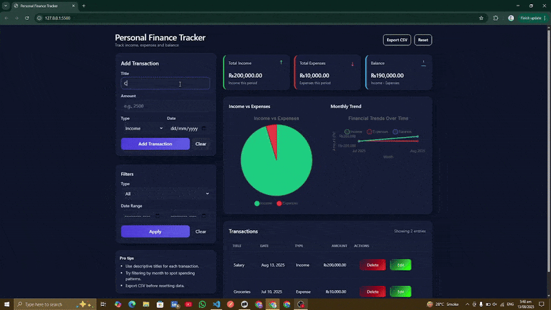

# Personal Finance Tracker

A private, easy-to-use financial tracker for managing your day-to-day income and expenses.  
Includes interactive charts, filters, and data export functionality to help you stay on top of your finances.

---

## 📑 Table of Contents

1. [Features](#-features)
2. [Tech Stack](#-tech-stack)
3. [Live Demo](#-live-demo)
4. [License](#-license)

---

## 🚀 Features

- **Add / Edit / Delete Transactions** — manage your income and expenses with ease
- **Filter by Date or Type** — quickly find specific records
- **Export Data** — save your transaction history for backup or analysis
- **Visual Insights** — pie and line charts display spending and income trends over time
- **Responsive UI** — built with Tailwind CSS for a smooth experience across devices

---

## 🛠 Tech Stack

- **HTML**
- **Tailwind CSS**
- **JavaScript**

---

## 📦 Live Demo

[Click here to try it out](https://pft-app.netlify.app/)

---

## 📜 License

This project is licensed under the **GitHub default license**.

## 🎥 Demo

